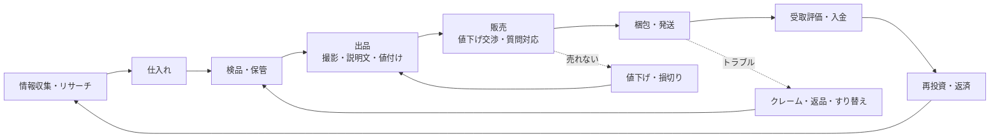

# 転売活動の調査レポート

「転売屋（転売ヤー）」の活動を、ゲームに落とし込むために調べた内容をまとめる。
目的は批判でも推奨でもなく、**転売という商いがどういう手順で成り立ち、何が楽しく、どこに落とし穴があるのか**を正確に把握すること。

> 専業転売屋の生活リズムや商材別の実態は、追加調査 [04_pro_reseller_life.md](04_pro_reseller_life.md) にまとめている。
>
> 手数料・法律などの数値は 2026年9月時点で確認できた情報をもとにしている。ゲーム内ではこれを簡略化して使う。実際の運用ルールは各サービス・官公庁の最新情報を確認すること。

---

## 1. 用語

| 用語 | 意味 |
| --- | --- |
| 転売 | 買った商品を、より高い値段で他人に売ること。一般的な小売も広い意味では転売 |
| せどり | 古本業界の「背取り（本の背を見て掘り出し物を抜き取る）」が語源。安く仕入れて価格差で売る個人物販の総称 |
| 転売ヤー | 転売＋バイヤーの造語。主に**品薄の限定品を買い占めて高値で売る人**を揶揄する言葉 |
| 店舗せどり / 電脳せどり | 実店舗で仕入れる / ネット通販・フリマで仕入れる |
| プレ値 | プレミア価格。定価を超えて取引される状態 |
| 相場 | その商品が実際に取引されている価格帯。フリマの「売り切れ」検索などで調べる |
| 再販 | メーカーが同じ商品を再生産・再販売すること。プレ値崩壊の最大の要因 |
| 回転 | 仕入れてから売れるまでの速さ。資金効率に直結する |

---

## 2. 転売が成立するサイクル



1. **情報収集・リサーチ**：発売情報、抽選・予約の開始、再販の噂、テレビやSNSでの紹介、フリマの売り切れ価格。ここで勝負の大半が決まる。
2. **仕入れ**：店舗・通販・抽選・予約・行列・フリマ・中古店など。「いくらで仕入れて、いくらで売れるか」を仕入れる前に計算する。
3. **検品・保管**：真贋・傷・付属品の確認。部屋が段ボールで埋まっていく。生ものや季節ものは時間との勝負。
4. **出品**：写真（自然光、箱の角まで）、説明文（状態、付属品、喫煙者・ペットの有無）、値付け、プラットフォーム選び。
5. **販売**：「値下げできますか？」「即購入OKですか？」などのコメント対応。売れなければ値下げ・損切り。
6. **梱包・発送**：プチプチ、段ボール、コンビニや郵便局への持ち込み。件数が増えると肉体労働になる。
7. **受取評価・入金**：購入者の受取評価で売上が確定。評価が遅れると入金も遅れる。
8. **再投資**：売上金で次を仕入れる。資金を回し続けることで規模が大きくなる。

**ゲームへの落とし込み**：1週間を1ターンとし、「行動（仕入れ・作業・休養）を1つ選ぶ → 出品を管理する → 週末に販売・発送・トラブル判定 → 翌週に入金」という流れで、このサイクルをそのまま回す。

---

## 3. 仕入れルート

| ルート | 内容 | 特徴 | ゲームでの表現 |
| --- | --- | --- | --- |
| 店舗（量販店・ホームセンター等） | ワゴンセール、閉店セール、型落ち、値札ミス | 足で稼ぐ。体力を使う。利幅は小〜中 | 「店舗せどり」 |
| 中古店・古本屋 | リサイクルショップ、古本の均一棚 | 仕入れに**古物商許可**が必要。掘り出し物の宝庫。偽物リスクあり | 古物商許可で解禁 |
| 通販のポイント還元 | 還元率の高いセール日に定価で買い、ポイントを利益にする | いわゆる「ポイ活せどり」。相場が定価付近でも成立する | 「電脳せどり」のポイント還元 |
| 予約 | 発売前の予約枠を確保 | 予約開始直後に売り切れることが多い | 電脳せどりで「予約受付中」 |
| 抽選 | 限定品の購入権を抽選で得る | 当たれば定価で買える。名義を借りる・複数アカウントなど規約違反の誘惑がある | 「抽選に応募」（正攻法／家族に頼む／捨てアカ） |
| 行列（並び） | 発売日・再販日・イベント会場で早朝から並ぶ | 体力とメンタルを大きく使う。目立つ・晒されるリスク | 「行列に並ぶ」 |
| フリマ内の価格差 | フリマで安く出ている品を買って高く売る | 個人から買った品は、未使用でも「古物」扱い | 古物商許可で解禁 |
| 海外通販・出所不明品 | 激安品 | 偽物・盗品のリスクが高い。仕入れ先の確認は古物商の義務 | 「海外通販で激安！」・石川五右衛門 |
| 正規店 | 高級時計などを定価で購入 | 在庫がほとんど出ない。購入実績を積む「正規店マラソン」 | 「王妃の黄金時計」 |
| 福袋 | 初売りの福袋の中身を売る | ほぼギャンブル | 1月の福袋イベント |

---

## 4. 販売チャネルと手数料

| チャネル | 手数料の目安 | 特徴 |
| --- | --- | --- |
| フリマアプリ（例：メルカリ） | 販売価格の10% | 利用者が多く回転が速い。値下げ交渉・質問が多い |
| オークション（例：Yahoo!オークション） | 落札価格の10%（2024年6月に会員区分によらず一律化） | 競り上がりが期待できる。コレクター品向き。入札ゼロもある |
| 大手EC（例：Amazon） | 月額の出品サービス料＋カテゴリ別の販売手数料（多くは8〜15%程度）＋倉庫サービス手数料 | 新品を大量に売るのに向く。真贋調査で請求書の提示を求められ、出せないとアカウント停止になりうる |
| 専門マーケット（スニーカー・トレカ等） | サービスごと | 鑑定つき、相場が見える |
| 買取業者 | 買取価格による | 早く現金化できるが安い |

**利益の計算式**

```
利益 = 販売価格 − 販売手数料 − 送料 − 梱包資材 − 仕入れ値 （− 振込手数料・交通費・ポイント差）
```

定価で買って「定価の1.1倍」で売っても、手数料10%と送料で**ほぼ利益は残らない**。
「相場 × 0.9 − 送料 − 仕入れ値」が一目で分かる表示は、ゲームの UI にもそのまま入れている。

**キャッシュフロー**

- 売上金は受取評価のあとに確定する。購入者が評価しないと入金が遅れる。
- クレジットカードで仕入れると支払いは翌月以降。**売れる前に引き落とし日が来る**と資金がショートし、リボ払いに流れる。
- 在庫は「売れるまではただの現金の塊（しかも場所をとる）」。

---

## 5. ジャンル別の特徴

| ジャンル | 相場の動き | リスク | ゲームの商品（MCHエクステンション） |
| --- | --- | --- | --- |
| スニーカー | 発売直後がピーク。コラボ品は高騰 | 偽物が非常に多い | ブーツ／大西部のブーツ／コボルドの黄金ブーツ |
| トレカ | 新弾の発売直後が高く、再販で急落。絶版BOXは長期で上昇 | 再シュリンク（開封済みを包み直した偽装品）、サーチ済み | スクロール／兵法書／大唐西域記 |
| ゲーム機 | 品薄期はプレ値、供給が追いつくと定価割れ | 抽選の条件が厳しくなりがち。国内専用版などの対策 | フォトングラス |
| フィギュア・イベント限定品 | 会場限定はプレ値。受注生産が決まると下落 | 徹夜・始発組、行列トラブル | シルフ |
| 酒 | プレミアウイスキーは値崩れしにくい | **継続して売るには酒類販売業免許が必要** | サケ／ネクタール |
| 時計 | 高級時計は正規店で買えれば大きな利ざや | 資金拘束が巨大。偽物 | 懐中時計／王妃の黄金時計 |
| 季節もの | ピークを過ぎると一気に値崩れ | 在庫を抱えると翌年まで売れない | 冬の甘えんぼ王子ウィンター／雛人形 |
| 食品（催事スイーツ等） | 催事の週だけ高い | 賞味期限、衛生面 | とっておきのシュークリーム |
| 古本・中古 | 均一棚から掘り出し物 | 古物商許可が必要 | ノービスブック／罪と罰 |
| ブーム系（例：2025年のブラインドボックスぬいぐるみ） | SNSで突然バズって暴騰し、突然終わる | 偽物（パチモン）が大量に出回る | カエルキッズ |
| ヴィンテージ・ブランド | ゆっくり上昇、買い手は少ない | 真贋判定が難しい | イル・カノーネ／マリーアントワネット・ブルー |

---

## 6. やりがい（楽しさ）

ゲームの「気持ちいい瞬間」の源泉になる部分。

1. **目利きが当たる快感**：ワゴンの奥で見つけた値札ミス、均一棚の絶版本。「自分だけが価値に気づいた」瞬間。
2. **相場を読む面白さ**：発売・再販・テレビ紹介・ブームの予兆から値動きを予測し、売り時を当てる。株や相場ゲームに近い知的快感。
3. **利益確定の快感**：「購入されました」の通知。数字が積み上がっていく手応え。
4. **仕入れ先の開拓**：どの店がいつ値引きするか、自分だけの「地図」ができていく。
5. **スキルの成長**：写真が上手くなると同じ商品でも高く売れる。梱包が速くなる。トラブルをさばけるようになる。
6. **ポイ活のゲーム性**：還元率やキャンペーンを組み合わせて利益を作るパズル。
7. **感謝される瞬間**：「近くに売っていなくて助かりました」。地方や忙しい人に品物を届ける側面も確かにある。
8. **仕組み化・事業化**：外注、倉庫、法人化。個人の小商いが「会社」になっていく。

---

## 7. 落とし穴・リスク

ゲームの「生々しさ」の源泉になる部分。

### 7.1 相場・在庫
- **再販による暴落**：メーカーの再販・受注生産の発表で、プレ値が一晩で消える。
- **季節もの・ブームの終わり**：ピークを過ぎた在庫は売れない。
- **在庫過多・資金拘束**：売れ残りで現金がなくなり、次の仕入れも返済もできなくなる。
- **部屋が段ボールで埋まる**：生活空間の圧迫、家族との摩擦。

### 7.2 取引トラブル
- **値下げ交渉**：「◯◯円になりませんか？即決します」。
- **受取評価をしない購入者**：入金が遅れる。
- **すり替え返品詐欺**：本物を送ったのに「偽物だった」と偽物を返品される。発送前の写真・シリアル記録が防御策。
- **イメージ違いの返品**、**いたずら購入（支払いをしない）**、**悪い評価**。
- **配送中の破損**：梱包が甘いと箱潰れ。
- **偽物をつかむ**：安すぎる仕入れ先。知らずに売っても返金・評価低下・アカウント停止。知っていて売れば商標法違反。

### 7.3 プラットフォームと世間
- **規約違反とアカウント停止**：複数アカウント、無在庫転売、禁止商品の出品など。
- **抽選の不正応募**：名義貸し・複数アカウントは当選取り消しの対象になることが多い。
- **世間の目・晒し・炎上**：行列の写真をSNSに上げられる、掲示板で晒される。
- **店舗の転売対策**：「転売目的と思われるお客様への販売はお断り」、お一人様1点、開封して渡す、購入履歴による抽選条件。

### 7.4 お金
- **カード払いとリボ地獄**：支払日に売上が間に合わない。
- **情報商材・高額塾**：「誰でも月収100万円」という勧誘。借金してまで払ってしまう人もいる。
- **税金**：利益は所得。申告しなければ追徴課税。
- **一発逆転の誘惑**：主人公のクリスにとっては仮想通貨。

### 7.5 体と時間
- 早朝の行列、深夜の相場チェック・抽選結果の確認、大量の梱包で腱鞘炎、郵便局通い。
- 「時給換算すると、バイトの方がよかったのでは？」問題。

---

## 8. 法律・規制

| 法律・制度 | 要点 | ゲームでの扱い |
| --- | --- | --- |
| 古物営業法 | 中古品（一度でも消費者の手に渡った物。未使用品を含む）を仕入れて売るには**古物商許可**が必要。申請手数料は19,000円、審査は40日程度。盗品の疑いがある品の取引を避ける義務 | 「古物商許可を申請」→6週後に中古・フリマ仕入れが解禁。盗品を買うと押収 |
| チケット不正転売禁止法（2019年6月施行） | 特定興行入場券を、業として定価を超えて転売することなどを禁止。罰則は1年以下の拘禁刑（旧・懲役）もしくは100万円以下の罰金、またはその併科 | 友人のチケット転売イベント。公式リセールが正解 |
| 国民生活安定緊急措置法 | 品不足時に政令で特定商品の転売を禁止できる。2020年のマスク・消毒液、2025年6月の米（備蓄米を含む）に適用。米の規制は品薄解消を受けて2026年1月に解除の方針 | 「法律で禁止されているものを除けば違法ではない」という前提をマインが説明 |
| 酒税法（酒類販売業免許） | 酒類を継続的に販売するには免許が必要。家庭の不要品を一時的に売るのとは違う | 酒を3本売ると税務署の指摘で酒類の出品停止 |
| 商標法 | 偽ブランド品の販売は商標権の侵害 | 偽物販売でアカウント警告・利用制限 |
| 医薬品医療機器等法 | 許可なく医薬品を販売できない | 今後の追加候補 |
| 所得税（確定申告） | 物販の利益は所得。給与所得者の副業は所得20万円超で確定申告が必要（住民税は別途申告）。令和7年分から基礎控除が見直された | 2月の確定申告イベント。申告しないと3月に追徴 |

---

## 9. メーカー・小売の転売対策

- 抽選販売（購入履歴、会員歴、プレイ時間などを条件にする）。例：2025年発売のゲーム機では、ソフトのプレイ時間50時間以上・有料会員の累計加入1年以上などが抽選の条件にされた。
- お一人様1点、本人確認、購入時の開封、名入れ。
- 受注生産・再販で「買えない」状況そのものをなくす。
- 公式リセール（定価での譲渡の場）。
- 国内専用版・言語限定版。

それでも、フリマでは定価の1.5倍前後で出品され続けた例もあり、対策と転売はいたちごっこになりやすい。

---

## 10. 小ネタ集（ゲーム内テキスト・イベントの素材）

- 「プロフ必読」「即購入禁止」「専用出品です」「おまとめ割できます」
- 「はじめまして♪ ◯◯円になりませんか？ 即決します🙏」
- 評価コメント「梱包が雑でした（プチプチが一重）」
- 「喫煙者・ペットなし」「自然光で撮影」「箱に多少の潰れあり」
- 郵便局の窓口で「いつもありがとうございます」と顔を覚えられる
- コンビニで10件まとめて発送して後ろに行列
- 深夜3時に抽選結果メールを確認して寝不足
- 当選したのにお金がなくて辞退
- 並び屋を雇う業者、行列を撮影してSNSに上げる人、誕生日プレゼントを買いに来た親子
- 再シュリンク品、サーチ済みパック
- 「海外セレブが紹介」でブーム到来、そしてパチモン流通
- 情報商材「月収100万円のロードマップ」、そして自分も有料noteを書き始める
- 福袋の中身がほぼ在庫処分品

---

## 11. 世論と風刺の視点

ゲームのトーンを決めるために、賛否の両方を整理した。

**批判的な見方**
- 品薄の商品を買い占め、本当に欲しい人が定価で買えなくなる。
- 行列・抽選の公平性を損なう。業者による組織的な買い占め。
- 偽物や詐欺の温床になる。

**擁護・中立的な見方**
- 地方で手に入らない人、時間がない人に「時間と手間を代行して」届けている。
- メーカーの価格設定と需要のズレ（ミスプライス）を市場が埋めているにすぎない。
- 中古流通・古本のせどりは、埋もれた品を必要な人に届ける側面がある。

**このゲームのスタンス**
- 転売を**奨励も糾弾もしない**。転売という商いの仕組み・楽しさ・しんどさ・危うさを、真剣にプレイさせることで体験させる。
- 違法行為（チケット高額転売、盗品・偽物の販売、無申告）は、はっきり「やってはいけないこと」として描き、ゲーム上も大きなリスクにする。
- 「買えなかった誰か」と「助かった誰か」の両方を、押しつけずに見せる（SNSの投稿、感謝のメッセージ、サンタの依頼、エンディングの一文）。
- 偉人たちが自分の逸話で商売を語る（伊能忠敬の「足で稼ぐ」、平賀源内の「土用の丑の日」、ニュートンの南海泡沫事件、マルクスの G–W–G′）。説教ではなく、笑いと納得で風刺する。

---

## 参考にした情報源

- [メルカリ手数料の解説（2026年）](https://www.toolboxjp.com/blog/mercari-fees-guide)
- [Yahoo!オークション、落札システム利用料を一律10%に改定（ネットショップ担当者フォーラム）](https://netshop.impress.co.jp/node/12364)
- [Yahoo!オークション 落札システム利用料の改定（公式のお知らせ）](https://auctions.yahoo.co.jp/topic/notice/function/post_3722/)
- [古物商許可の取り方（STORES Magazine）](https://stores.fun/magazine/articles/kobutsusho-kyoka-torikata)
- [古物商許可の申請費用は19,000円（行政書士の古物商許可ガイド）](https://www.good-co.net/cost/)
- [米穀の転売規制の解除について（農林水産省）](https://www.maff.go.jp/j/syouan/keikaku/soukatu/tenbai_kisei.html)
- [国民生活安定緊急措置法施行令の一部改正案について（消費者委員会 資料, 2026年1月）](https://www.cao.go.jp/consumer/iinkai/2026/479/doc/20260113_shiryou1-2.pdf)
- [備蓄米などに対する転売規制について（Yahoo!ニュース エキスパート）](https://news.yahoo.co.jp/expert/articles/c20f3db8c8a7f94e18e04346730d0fea47680494)
- [任天堂Switch2の「完璧すぎる転売対策」の落とし穴（ダイヤモンド・オンライン）](https://diamond.jp/articles/-/362991)
- [Nintendo Switch2の「抽選販売」、転売ヤーにとっては「むしろ好都合」な理由（マネー現代）](https://gendai.media/articles/-/151354)
- [ポケモンカード・Switch2と中国系転売組織（マネー現代）](https://gendai.media/articles/-/156919)
- [転売で失敗した10の事例と対策（EC STARs Lab.）](https://ecstarslab.com/blog/tenbai-failure/)
- [Amazonせどりで実際にあったトラブルと対処法](https://www.roadtookuribito.blog/trouble/)
- [せどりはやめたほうがいい？主な理由や被害事例（丹青法律事務所）](https://tansei-legaloffice.jp/tansei-blog/consumer-damage-fraud/7917/)
- [返品詐欺とは（朱雀スタジオ）](https://suzaku.or.jp/suzaku-studio/archives/15171)
