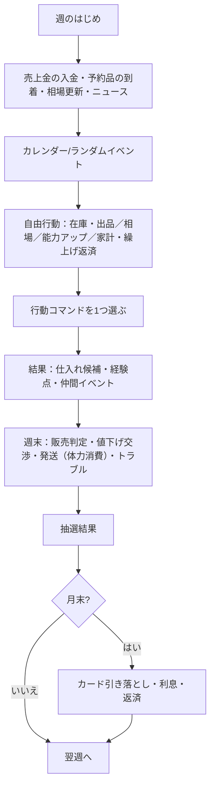

# 企画書：テンバイヤー！ 〜クリスの借金返済サクセス〜

## 1. 概要

| 項目 | 内容 |
| --- | --- |
| タイトル | テンバイヤー！ 〜クリスの借金返済サクセス〜（リポジトリ名 `10buy-year` = テン・バイ・イヤー） |
| ジャンル | 育成シミュレーション（パワプロ「サクセス」型）× 相場トレード |
| 題材 | 転売・せどり |
| 位置づけ | 社会風刺ゲーム。転売を奨励も糾弾もせず、「真剣に転売をやる」体験を通して仕組みと生々しさを描く |
| 使用アセット | My Crypto Heroes のヒーロー・エクステンション・エネミー・背景・音声、オリジナルキャラ（クリス／マイン／マイクリくん） |
| プラットフォーム | ブラウザ（スマホ縦画面優先、PC対応）。ビルド不要の静的サイト |
| 1プレイ | 48週（約30〜60分）。周回して最終資産のハイスコアを競う |

### コンセプト

> **「仕入れて、売って、学んで。1年で借金を返せ。」**

- パワプロのサクセスの「限られたターンで行動を選び、能力を育て、イベントで特殊能力を得て、最後に査定される」気持ちよさを、転売の「リサーチ → 仕入れ → 出品 → 発送 → 入金」サイクルに重ねる。
- 相場・手数料・送料・入金タイミング・カードの支払日・在庫スペースなど、**現実の転売で効いてくる制約をそのままゲームのルールにする**。
- 楽しさ（目利きが当たる、プレ値で売れる、仕組みが回り出す）と、落とし穴（再販暴落、すり替え詐欺、晒し、リボ、税金）の両方を、マイクリのキャラクターとアセットで笑えるように描く。

---

## 2. ストーリー

### プロローグ
クリスは「億り人」を夢見て仮想通貨（$HEROコイン）に全力投資。レバレッジ、カードローン、友人からの借金まで重ねた末、一晩の大暴落でロスカットされ、**150万円の借金**だけが残った。
落ち込むクリスのもとにナビ役のマインが現れる。そこへマイクリくんの速報「限定スニーカーがフリマで定価の2.4倍！」。
クリスは「一発逆転じゃなく、一個ずつ確実に」転売で借金を返すと決意する。

### ルール上の目標
- 期限：4月第1週〜翌年3月第4週（48週）
- 毎月末に最低3万円を返済。利息は年15%。**3回滞納で債務整理（ゲームオーバー）**
- 最終査定の「純資産」（現金＋入金待ち＋ポイント＋在庫評価額×0.7 − 借金 − カード未払い）がスコア

### 登場人物

| キャラ | 素材 | 役割 |
| --- | --- | --- |
| クリス | オリジナル（ドット絵） | 主人公。仮想通貨で溶かした元・クリプト民 |
| マイン | オリジナル（ドット絵） | ナビゲーター兼経理。法律・手数料・税金の解説役（パワプロの「矢部くん＋解説」） |
| マイクリくん | オリジナル（ドット絵） | メガホンで速報を叫ぶニュース役 |
| 伊能忠敬 | ヒーロー | 商人として成功した後、50歳から全国を測量した。「足で稼げ」の店舗せどり師匠 |
| 平賀源内 | ヒーロー | 「土用の丑の日」のコピーライター。出品文と写真の師匠 |
| ニュートン | ヒーロー | 南海泡沫事件で大損した天才。バブル（ブーム）の恐ろしさを語る |
| 石田三成 | ヒーロー | 帳簿の鬼。確定申告と経理 |
| 一休 | ヒーロー | とんちでクレーム・すり替え詐欺への切り返しを教える |
| マルクス | ヒーロー | 公園の経済学者。「G–W–G′、君の転売は資本の運動そのものだ」 |
| 織田信長 | ヒーロー | 楽市楽座。自由な市場には自由な者もずる賢い者も集まる |
| 坂本龍馬 | ヒーロー | 海援隊（日本初の商社）。「会社にするぜよ」→ 2年目・法人化の伏線 |
| マルコ・ポーロ | ヒーロー | 相場は「場所と時間の差」。輸出の伏線 |
| 福沢諭吉 | ヒーロー | 一万円札そのもの。「学ぶ者と学ばざる者の差」 |
| ノストラダムス | ヒーロー | 月額98,000円の「相場大予言サロン」主宰（情報商材） |
| 石川五右衛門 | ヒーロー | 出所不明品の卸業者（盗品の誘惑） |
| サトシ・ナカモト | ヒーロー | 仮想通貨への再びの誘惑 |
| サンタクロース | ヒーロー | 12月、在庫を「定価で譲ってほしい」と頼みに来る |
| ナイチンゲール | ヒーロー | 体調を崩したときに現れる。統計で生活習慣を叱る |
| マリー・アントワネット | ヒーロー | 高級品を相場の2割増しで買う客。「お金がないなら、借りればいいじゃない」 |
| トラブルの化身 | エネミー | クレーマー、すり替え詐欺師、値下げ交渉の民、音信不通の購入者、怪しい業者、督促状の化身 |

偉人は**自分の逸話で商いを語る**。偉人を転売ヤーそのものにはせず、「師匠・客・誘惑・解説者」として登場させることで、マイクリの世界観を損なわずに風刺を成立させる。

### エンディング

| エンディング | 条件 |
| --- | --- |
| 御用END | 違法行為（チケット高額転売・盗品購入）を2回重ねる |
| 債務整理END | 返済を3回滞納 |
| 結局クリプトEND | 完済したが、仮想通貨の爆益を当てていた |
| 物販社長END | 完済し、純資産300万円以上 |
| まっとうな商人END | 完済し、サンタに定価で譲り、炎上度が低い |
| 完済END | 完済 |
| 返済はつづくよEND | 期限までに完済できなかった |

最終査定ではランク（S〜G）と称号（ワゴンの魔術師／限定品ハンター／古物の目利き／バブルの申し子／炎上系セラー／買い占めの帝王 …）が付く。
あわせて「定価で確保した品薄商品の数」を表示し、「その向こうには買えなかった誰かも、助かった誰かもいたかもしれない」と一文だけ添える（押しつけない風刺）。

---

## 3. パワプロ「サクセス」との対応

| サクセス | テンバイヤー！ |
| --- | --- |
| 3年間・週単位のターン | 1年間（48週）・週単位のターン |
| 練習メニュー | 行動コマンド（店舗せどり、電脳せどり、抽選、行列、出品作業…） |
| 体力 | 体力（行動と梱包・発送で減る。休む・気晴らしで回復） |
| やる気（絶不調〜絶好調） | やる気。経験点の倍率 ×0.6〜×1.4 |
| ケガ・ケガ率 | 体調不良・体調不良率（体力が低いまま重い行動をすると発生。2週休養＆発送遅延） |
| 経験点（筋力・敏捷・技術・変化球・精神） | 経験点（情報・行動・技術・対人・精神） |
| 基礎能力（ミート・パワー…） | 基礎能力（目利き・仕入れ・出品・交渉・梱包）、ランク G〜S |
| 特殊能力（青特・金特・赤特） | 特殊能力（青：経験点で習得／金：仲間イベントのコツが必要／赤：マイナス、経験点で治療） |
| コツ | コツ（偉人から教わる。習得コストが下がる。金特は必須） |
| 仲間・彼女イベント | 偉人イベント（出会い→2回目→完成、の連続イベント） |
| 試合 | 月末の返済日（毎月の「勝負」） |
| 査定・選手完成 | 最終査定・ランク・称号・ランキング |

### 基礎能力

| 能力 | 効果 | 上げるのに使う経験点 |
| --- | --- | --- |
| 目利き | 推定相場の誤差（±32%→数%）、怪しいオファーに気づく | 情報＋精神 |
| 仕入れ | 仕入れ候補の数、抽選の口数と当選率、行列の成功率 | 行動＋情報 |
| 出品 | 高めの値付けでも売れる、出品枠（5＋出品/10） | 技術＋情報 |
| 交渉 | トラブル発生率の低下、交渉判定の成功率 | 対人＋精神 |
| 梱包 | 発送の体力消費、配送破損率 | 行動＋技術 |

能力を+1するコストは `3 + floor(現在値/10)×1.5` を基準に、主経験点×1.0、副経験点×0.5。

### 特殊能力（MVPで実装済み）

- 青：早起き／ポイ活の鬼／写真映え／即レス／梱包職人／プロフ必読／限定の嗅覚／鋼のメンタル／シリアル控え／値切り上手
- 金：大日本沿海輿地全図（伊能忠敬）／土用の丑の日（平賀源内）／群衆の狂気（ニュートン）／大一大万大吉（石田三成）／このはし渡るべからず（一休）／天下布武（織田信長）
- 赤：楽観主義／腱鞘炎／寝不足／炎上体質

---

## 4. 1週間の流れ

### 行動コマンド

| コマンド | 体力 | 主な経験点 | 内容 |
| --- | --- | --- | --- |
| 店舗せどり | −15 | 行動12 情報5 対人2 | ワゴン・閉店セール・値札ミス・店頭在庫・（許可後）中古・正規店 |
| 電脳せどり | −8 | 情報13 技術4 | ポイント還元・予約・公式通販の在庫復活・（許可後）フリマ・海外激安（偽物リスク）＋相場メモ |
| 抽選に応募 | −5 | 情報6 精神6 | 受付中の抽選に一括応募。正攻法／家族に頼む（+2口）／捨てアカ（+6口・規約違反） |
| 行列に並ぶ | −28 | 行動15 精神10 | 発売日・再販日・催事・ブーム時に。成功で定価の購入権。炎上度+ |
| 撮影・出品作業 | −12 | 技術14 情報4 | その週の売れ行き×1.25 |
| 物販交流会 | −10 | 対人14 情報6 | 参加費3,000円。ニュートン・信長・龍馬に会える |
| 勉強する | −4 | 情報9 精神7 技術2 | 三成・諭吉・ノストラダムスに会える |
| 日雇いバイト | −25 | 行動4 精神5 | +22,000円の確実な収入 |
| 気晴らし | +15 | 精神3 | 8,000円。やる気+1。マルクスに会える |
| 休む | +45 | — | 体調不良の回復 |
| 古物商許可を申請 | −8 | 情報5 精神3 | 19,000円。6週後に中古・フリマ仕入れ解禁（1回のみ） |

---

## 5. 経済モデル

### 5.1 相場
商品ごとに「定価に対する倍率」を持ち、毎週更新する。種類ごとの動き：

| 種類 | 動き |
| --- | --- |
| 定番 | 定価付近で平均回帰。値引き・ポイントで利ざやを取る |
| 限定 | 発表→抽選・予約→発売日にピーク→徐々に下落。**再販**でさらに暴落 |
| コレクター | ゆっくり上昇。買い手が少ない（オークション向き） |
| 季節 | ピーク週に向けて上昇、過ぎると一気に下落 |
| 生もの | 催事の週だけ買える。翌週までに売らないと廃棄 |
| ブーム | 予兆ニュース→SNSでバズって5週で最大6倍→崩壊 |
| 高級 | 定価の1.5倍前後で安定。正規店でまれに買える |

テレビ紹介などのショックで一時的に上下する。プレイヤーが見るのは「推定相場」で、目利きが低いと最大±30%ぶれる（週ごとに固定のノイズ）。

### 5.2 販売
- **メルクリ（フリマ）**：その週の買い手の数（需要×評価×出品作業ボーナス）を決め、安い出品から順に「相場との比率」で売れるか判定。比率1.0で約70%、1.2で約15%。
- **クリオク（オークション）**：入札者数で落札価格が決まる。最低落札価格に届かなければ流札。コレクター品・高級品は入札者が多い。
- 手数料10%（天下布武で7%）、送料は小210円／中750円／大1,600円（10万円以上の高額品は1,500円以上）。
- 売上金は翌週入金。受取評価されないと2週遅れる。
- 1件ごとに梱包・発送の体力（小2／中3／大6）。足りなければ発送遅延（評価ダウン、クレーム増）。
- 出品中に値下げ交渉コメントが来る（最大2件/週）。

### 5.3 トラブル（1件ごとに判定）
基本7%（交渉力・プロフ必読・即レスで減少、発送遅延で増加）。偽物を売ると85%で発覚。

| トラブル | エネミー | 内容 |
| --- | --- | --- |
| 音信不通 | ゴースト | 受取評価されず入金が遅れる |
| すり替え返品 | バイトバンディット | 事務局に相談（交渉判定）か返金。シリアル控えで撃退 |
| クレーマー | クリーパー | 誠実に説明（交渉判定）／半額返金／無視 |
| イメージ違い | ラブレター | 返品受付（往復送料自腹）／ノークレームノーリターン |
| 悪い評価 | クリーパー | 評価ダウン・やる気ダウン |
| いたずら購入 | ゴースト | 取引キャンセル |
| 配送破損 | クリーパー | 返品・傷あり（価値半減） |
| 偽物発覚 | クリーパー | 返金・評価−15・炎上＋10・2回で利用制限4週 |

### 5.4 お金
- 開始時：現金10万円、借金150万円、カード枠50万円
- カード払いは翌月末に引き落とし。足りなければ不足分がリボ払いとして借金に加算（＋手数料3%）
- ポイント：電脳の還元とカード還元（1%／ポイ活の鬼で2%）。仕入れ時に自動で使う
- 部屋の容量30（小1・中2・大4）。超えると休んでも回復しにくく、やる気が下がる
- 評価（0〜100）：売れ行きに影響。炎上度（0〜100）：50以上で晒し、80以上でメルクリ利用制限

---

## 6. 商品一覧（MCHエクステンション）

| 商品（エクステンション名） | ジャンル | 種類 | 定価／参考価格 | 備考 |
| --- | --- | --- | --- | --- |
| ブーツ | 定番スニーカー | 定番 | 12,000 | |
| 懐中時計 | 定番ウォッチ | 定番 | 26,000 | |
| サケ | 地酒 | 定番 | 3,300 | 酒類（3本売ると出品停止） |
| スクロール | トレカBOX（定番） | 定番 | 5,500 | |
| ノービスブック | 古本 | コレクター | 900 | 中古・要許可 |
| 兵法書 | 人気トレカ新弾BOX | 限定 | 5,500 | 4月第3週発売。再販多め |
| 大西部のブーツ | コラボスニーカー | 限定 | 22,000 | 5月第2週発売 |
| シルフ | 限定フィギュア | 限定 | 9,800 | 7月発売、8月のマイクリフェスでも |
| コボルドの黄金ブーツ | 超限定スニーカー | 限定 | 38,000 | 9月発売。抽選は狭き門 |
| ネクタール | プレミアウイスキー | 限定 | 11,000 | 10月発売。値崩れしにくい |
| フォトングラス | 新型VRゲーム機 | 限定 | 49,980 | 11月末発売。年末商戦 |
| 罪と罰 | 絶版本 | コレクター | 9,000 | 中古・要許可 |
| 大唐西域記 | 絶版トレカBOX | コレクター | 58,000 | 中古・シュリンク偽装に注意 |
| イル・カノーネ | ヴィンテージ楽器 | コレクター | 180,000 | 中古・大型 |
| マリーアントワネット・ブルー | ブランドジュエリー | コレクター | 320,000 | 中古・偽物多い |
| 冬の甘えんぼ王子ウィンター | クリスマス限定ぬいぐるみ | 季節 | 4,400 | 12月第3週ピーク |
| 雛人形 | 雛人形 | 季節 | 48,000 | 2月ピーク、3月に暴落 |
| とっておきのシュークリーム | 催事限定スイーツ | 生もの | 2,800 | 6月・10月・2月の催事週のみ |
| カエルキッズ | ブラインドボックスぬいぐるみ | ブーム | 3,500 | 6〜9月のどこかでブーム（2週前に予兆ニュース） |
| 王妃の黄金時計 | 高級腕時計 | 高級 | 1,280,000 | 正規店でまれに |

MCH の「Rep（レプリカ）」レアリティは、将来「再販版」として同じ商品の別画像に使う予定。

---

## 7. イベント

- **カレンダー**：チュートリアル（第1〜2週）、初回返済前の注意、GW（買い手1.3倍）、アマクリデー（ポイント2倍）、マイクリフェス、ブラックフライデー、サンタ、初売り福袋、確定申告、追徴課税、最終週
- **ランダム**：部屋が段ボールで埋まる、郵便局で顔を覚えられる、コンビニ発送、実家からの電話、深夜の相場チェック（寝不足）、腱鞘炎、晒しスレ、メルクリ利用制限、テレビ紹介、感謝のメッセージ、SNSでの批判、チケット転売、酒類免許、有料note、仮想通貨の誘惑×2、王妃の爆買い、一休
- **行動後（仲間）**：伊能忠敬×3、店員の転売対策、石川五右衛門、マルコ・ポーロ、平賀源内×3、ニュートン×2、織田信長×2、坂本龍馬、石田三成×2、ノストラダムス、福沢諭吉、マルクス×2、倉庫バイト、行列の人々
- **体調不良**：ナイチンゲール

---

## 8. 表現・トーンのガイドライン

1. **真剣に**：転売の手順・数字・制度は正確に。「ちゃんとやるとこうなる」をゲームで体験させる。
2. **貶めない**：プレイヤーを悪者扱いしない。批判の声は SNS の一投稿として、感謝の声と並べて出す。
3. **違法は違法**：チケット高額転売・盗品・偽物・無申告は明確にNG扱いで、ゲーム上も大きな罰を与える。
4. **偉人は偉人として**：ヒーローは自分の逸話で語る師匠・客・誘惑役。転売ヤーそのものにはしない。
5. **笑いで刺す**：マルクスの G–W–G′、マリー・アントワネットの「借りればいいじゃない」、源内の土用の丑の日。説教ではなく「うまいこと言う」風刺。
6. **実在の企業名は使わない**：プラットフォームは「メルクリ」「クリオク」「アマクリ」などマイクリ風の架空名。

---

## 9. アセット利用方針

- MCH のヒーロー・エクステンション・エネミー画像は、[MCH デザインガイドライン](https://medium.com/mycryptoheroes/mch-design-guideline-ja-99ff0970ccdc)の範囲（非営利の二次創作）で使用する。背景・マテリアルは MCH Co., Ltd. の許諾範囲で保持しているもの。
- ガイドラインの禁止事項に「ゲームイメージを損なう内容」「公序良俗に反する内容」がある。転売を題材にするため、**一般公開の前に運営へ内容を確認してもらう**ことを推奨する（ロードマップ参照）。
- クリス／マイン／マイクリくんはリポジトリオーナーが権利を持つオリジナルキャラクターで、自由に利用・改変できる。クレジット：クリスくん／マインちゃん「ドット絵：こじもこ」、マイクリくん「原画：こはるさん／ドット絵：こじもこさん」。
- ドット絵は `image-rendering: pixelated` で拡大表示する。
- アセットは `tools/import_assets.py` で `mycryptoheroes` リポジトリから必要な分だけコピーする（背景は JPEG に縮小）。

---

## 10. 画面構成（MVP）

- **タイトル**：はじめから／つづきから／ランキング／このゲームについて
- **メイン**：HUD（日付・残り週・所持金・借金・体力・やる気・評価・炎上度・返済日アラート）、ステージ（背景・クリス・話し相手・ニュースティッカー）、メッセージウィンドウ、タブ（在庫／相場／能力／家計／メニュー）、行動コマンド（3列グリッド、体力・経験点・体調不良率を表示。2回押しで決定）
- **仕入れ**：候補ごとに仕入れ値・推定相場・見込み利益・タグ（ルート／種類／サイズ／ポイント／到着週／怪しい）・個数・現金／カード
- **在庫・出品**：出品枠・部屋の容量、プラットフォーム選択、価格（相場×0.9〜1.5のショートカット）、手数料・送料・利益のプレビュー
- **相場**：今週のニュース、抽選受付中の商品、商品ごとの推定相場・前週比・スパークライン
- **能力**：経験点、基礎能力（ランク・+1／+5）、特殊能力（習得・治療・コツLv）
- **家計**：現金・入金待ち・ポイント・借金・カード・滞納、繰上げ返済、成績、収支履歴
- **エンディング**：エンディング名・一枚絵・ランク・称号・成績・ランキング・結果コピー
