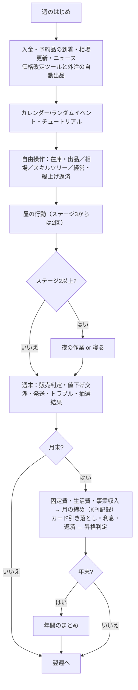

# 企画書：10 buy year！

## 1. 概要

| 項目 | 内容 |
| --- | --- |
| タイトル | **10 buy year！**（テン・バイ・イヤー＝転売屋 × 10年） |
| ジャンル | 育成シミュレーション × 相場トレード × インクリメンタル（スキルツリー・仕組み化） |
| 題材 | 転売・せどり |
| 位置づけ | 社会風刺ゲーム。転売を奨励も糾弾もせず、「真剣に転売をやる」体験を通して仕組みと生々しさを描く |
| 使用アセット | My Crypto Heroes のヒーロー・エクステンション・エネミー・背景・音声、オリジナルキャラ（クリス／マイン／マイクリくん） |
| プラットフォーム | ブラウザ（スマホ縦画面優先、PC対応）。ビルド不要の静的サイト（Vercel で配信） |
| 1プレイ | 10年（480週）。後半は仕組み化とオート進行でテンポが上がる。周回して最終資産を競う |

### コンセプト

> **「押し入れの本を1冊売るところから、10年の転売キャリアへ。」**

- 限られた週の中で行動を選び、経験点で能力とスキルツリーを育て、偉人たちとのイベントでコツを得て、最後に査定される。
- 転売の「探す → 仕入れる → 在庫を管理する → 売り先を決める → 売る」のサイクルを、**最初は家の不用品を売るところから**段階的に体験させる。
- 10年を5つのキャリアステージに分け、**ステージごとに見る指標（KPI）と使える手段が変わる**。副業の小遣い稼ぎ → 専業 → 法人 → 事業家、という現実の道筋をそのままゲームの進行にする。
- 相場・手数料・送料・入金タイミング・カードの支払日・在庫スペース・税金・生活費など、**現実の転売で効いてくる制約をそのままルールにする**。

### 表記ルール
- **ゲーム内では実在のゲームタイトル名を出さない**（テキスト・UI・コード内コメントも含む。テストで自動チェック）。育成システムの参考元は、この企画書の内部資料としてのみ記載する。
- 実在の販売サービス名は使わず、パロディ名にする（フリマ「プンシー」＝元ネタ OpenSea、オークション「ミィーム」＝元ネタ miime、大手EC「アマクリ」）。

---

## 2. ストーリー

### プロローグ
クリスは「億り人」を夢見て仮想通貨（$SAOコイン）に全力投資。レバレッジ、カードローン、そして友達にまで頭を下げて借りたお金を突っ込んだ末、一晩の大暴落でロスカットされ、**150万円の借金**だけが残った。
落ち込むクリスのもとにマインが現れ、「とりあえず、この部屋の物を売ったら？」。読み終えた本、かぶらない帽子、引き出物のグラス――。
クリスは「一発逆転じゃなく、一個ずつ確実に」と決意する。

クリスは転売の知識ゼロからのスタート。友達から借金してまで負債を作ってしまう性格どおり、**最初は利益計算もできず、相場も感覚でしか分からない**。できることはスキルツリーで少しずつ増えていく。

### ルール上の目標
- 期間：1年目4月第1週〜10年目3月第4週（480週）
- 毎月末に最低3万円を返済（利息は年15%）。**3か月連続で払えなければ債務整理（ゲームオーバー）**
- まずは借金の完済。その後は10年でどこまでキャリアを伸ばせるか
- 最終査定の「純資産」（現金＋入金待ち＋ポイント＋在庫評価額×0.7 − 借金 − カード未払い）がスコア

### 登場人物

| キャラ | 素材 | 役割 |
| --- | --- | --- |
| クリス | オリジナル（ドット絵） | 主人公。仮想通貨で溶かした元・クリプト民。転売は素人 |
| マイン | オリジナル（ドット絵） | ナビゲーター兼経理。法律・手数料・税金・KPIの解説役 |
| マイクリくん | オリジナル（ドット絵） | メガホンで速報を叫ぶニュース役 |
| 伊能忠敬 | ヒーロー | 商人として成功した後、50歳から全国を測量。「足で稼げ」の店舗せどり師匠 |
| 平賀源内 | ヒーロー | 「土用の丑の日」のコピーライター。出品文と写真の師匠 |
| ニュートン | ヒーロー | 南海泡沫事件で大損した天才。ブームの恐ろしさを語る |
| 石田三成 | ヒーロー | 帳簿の鬼。確定申告と経理 |
| 一休 | ヒーロー | とんちでクレーム・すり替え詐欺への切り返しを教える |
| マルクス | ヒーロー | 公園の経済学者。「G–W–G′、君の転売は資本の運動そのものだ」 |
| 織田信長 | ヒーロー | 楽市楽座。事業化のときにも現れる |
| 坂本龍馬 | ヒーロー | 海援隊（日本初の商社）。法人化をすすめる |
| マルコ・ポーロ | ヒーロー | 相場は「場所と時間の差」 |
| 福沢諭吉 | ヒーロー | 一万円札そのもの。「学ぶ者と学ばざる者の差」 |
| ノストラダムス | ヒーロー | 月額98,000円の「相場大予言サロン」主宰（情報商材） |
| 石川五右衛門 | ヒーロー | 出所不明品の卸業者（盗品の誘惑） |
| サトシ・ナカモト | ヒーロー | 仮想通貨への再びの誘惑 |
| サンタクロース | ヒーロー | 12月、在庫を「定価で譲ってほしい」と頼みに来る |
| ナイチンゲール | ヒーロー | 体調を崩したときに現れる |
| マリー・アントワネット | ヒーロー | 高級品を相場の2割増しで買う客。「お金がないなら、借りればいいじゃない」 |
| トラブルの化身 | エネミー | クレーマー、すり替え詐欺師、値下げ交渉の民、音信不通の購入者、怪しい業者、督促状の化身 |

偉人は**自分の逸話で商いを語る**「師匠・客・誘惑・解説者」として登場させ、転売ヤーそのものにはしない。

### エンディング（10年後のキャリア）

| エンディング | 条件 |
| --- | --- |
| 御用END | 違法行為（チケット高額転売・盗品購入）を2回重ねる |
| 債務整理END | 返済を3か月連続で滞納 |
| 返済はつづくよEND | 10年たっても借金が残っている |
| 結局クリプトEND | 完済したが、仮想通貨の爆益を当てていた |
| 事業家END | ステージ5（事業化・多角化）に到達 |
| 物販会社社長END | ステージ4（法人化・拡大） |
| まっとうな商人END | ステージ3以下で、サンタに定価で譲り、炎上度が低い |
| 専業せどらーEND | ステージ3（専業） |
| 副業せどらーEND | ステージ1〜2のまま完済 |

最終査定ではランク（S：5,000万円〜 … G）と称号が付く。「定価で確保した品薄商品の数」を表示し、「その向こうには買えなかった誰かも、助かった誰かもいたかもしれない」と一文だけ添える（押しつけない風刺）。

---

## 3. 10年のキャリアステージ

詳細と参考資料は [05_career_and_kpi.md](05_career_and_kpi.md)。

| ステージ | 目安 | 昇格条件 | できるようになること・変わること |
| --- | --- | --- | --- |
| 1 副業スタート | 0〜1年目 | — | 週1回の行動。チュートリアルで少しずつ解放 |
| 2 副業安定 | 1〜3年目 | 月の純利益5万円を2か月連続 | **夜の作業**（週1回、軽い作業だけ。体力を余計に使う）。アマクリ・レンタル倉庫・価格改定ツール・ルーティン化（オート進行） |
| 3 専業 | 3〜5年目 | 月の純利益が3か月平均30万円以上かつ各月20万円以上 → 専業になるか選ぶ | 行動が週2回、バイト不可、**生活費 月18万円**。外注（梱包・発送／撮影・出品）、業者オークション、AIリサーチツール、プンシーShops、玄人KPI |
| 4 法人化・拡大 | 5〜8年目 | 直近12か月の純利益800万円 → 法人化するか選ぶ | 設立費25万円、社会保険 月6万円、税は法人税（簡易計算）。問屋・メーカー直取引、外注：リサーチ・仕入れ（自動仕入れ）、物流倉庫 |
| 5 事業化・多角化 | 8〜10年目 | 直近12か月の純利益1,800万円＋外注3種 | 自社ブランド・買取事業・情報発信（毎月の事業収入） |

- 6年目以降は「年齢の壁」で、毎年体力の最大値が下がる（最低60）。自分で動く量を減らす仕組み化が効いてくる。
- 自動プレイでの到達時期の中央値：ステージ2＝約1.5年目、ステージ3＝約5.6年目、ステージ4＝約7.4年目。ステージ5は上手い人向け。

---

## 4. チュートリアル（最初の数週間）

最初は行動・販路・画面が絞られている。

| 解放されているもの | まだ使えないもの |
| --- | --- |
| 行動：家の中を探す／撮影・出品作業／図書館で勉強／日雇いバイト／気晴らし／休む | 店舗せどり・電脳せどり・抽選・行列・交流会・古物商申請 |
| 販路：プンシー（フリマ）だけ | ミィーム・アマクリ |
| 在庫・経営画面（素人の帳簿） | 相場画面、スキルツリー（最初の売上のあとに開く）、見込み利益の表示 |

| # | ミッション | 達成すると |
| --- | --- | --- |
| 1 | 家の不用品を出品しよう | 「家の中を探す」をすすめられる |
| 2 | 売れるのを待とう（週を進める） | 手数料・送料・入金の説明。「売上をあげるには仕入れ先・販路・目利き」→ **ツリーのタブが開く** |
| 3 | スキルツリーで仕入れ先を増やそう | 自分で「近所の店のワゴン」を解放 → 店舗せどりが使える |
| 4 | お店で仕入れ先を探そう | 初回は利益の出るワゴン品が必ず並ぶ |
| 5 | 商品を仕入れよう | 在庫の説明。販路を広げる話 |
| 6 | スキルツリーで販路を広げよう | 自分で「ミィーム」を解放 → 売り先を選べる |
| 7 | 売り先を決めて出品しよう | 値付けと値下げの説明 |
| 8 | 仕入れた商品を売ろう | その取引を「売値 − 手数料 − 送料 − 仕入れ値」で振り返る |
| 9 | スキルツリーで利益計算を覚えよう | 自分で「利益計算」を解放 → 見込み利益が出る。チュートリアル完了 |

- 販路・仕入れ先・機能は**自動では増えない**。すべてスキルツリーで自分の手で解放する（ステージ昇格や古物商許可は「解放できるようになる」条件）。
- ツリーのミッション中は、ツリーを開くと目標のパネルが選ばれた状態になり、パネルの上で▼が跳ねる。
- ツリーのタブには、いま解放できるパネルの数がバッジで出る。

--- | --- | --- |
| 1 | 家の不用品を出品しよう | 「家の中を探す」をすすめられる |
| 2 | 売れるのを待とう（週を進める） | 手数料・送料・入金の説明。**店舗せどり**が解放 |
| 3 | お店で仕入れ先を探そう | 初回は利益の出るワゴン品が必ず並ぶ |
| 4 | 商品を仕入れよう | 在庫の説明。**ミィーム**が解放（売り先を選べるように） |
| 5 | 売り先を決めて出品しよう | 値付けと値下げの説明 |
| 6 | 仕入れた商品を売ろう | その取引を「売値 − 手数料 − 送料 − 仕入れ値」で振り返る。**利益計算**と**スキルツリー**が解放 |

---

## 5. 転売屋スキルツリー

活動で貯めた経験点（情報・行動・技術・対人・精神）でノードを解放していくインクリメンタル要素。中心の「押し入れの宝の山」から**7本のルート**が放射状にのび、どのルートを伸ばすかで「どんな転売屋になるか」がおおよそ固まる（全69ノード）。

### 5.1 ルート

| ルート | 目指す姿（到達点） | 主なノード | 熟練度ボーナス（Lv1 / Lv2） |
| --- | --- | --- | --- |
| 店舗せどり | 店舗の鬼 | 近所の店のワゴン → 行列に並ぶ・値切り上手・早起き、偉人の奥義「大日本沿海輿地全図」 | 店舗の仕入れ候補+1 ／ 店舗巡りの体力-15% |
| 電脳・ポイ活 | 電脳の覇者 | ポイント通販 → 抽選・予約 → ポイ活の鬼・限定の嗅覚、AIリサーチツール（ステージ3） | 電脳の仕入れ候補+1 ／ ポイント還元+20% |
| 古物・目利き | 鑑定士 | 相場チェック → 古物商許可 → 真贋の知識・リサイクルショップ → フリマ仕入れ → 業者オークション（ステージ3）、偉人の奥義「群衆の狂気」 | 相場の誤差-10% ／ 偽物を見抜く確率+20% |
| 販路・出品 | 売れっ子セラー | ミィーム → アマクリ（ステージ2）→ プンシーShops（ステージ3）、写真映え、出品枠の拡張（Lv5）、偉人の奥義「土用の丑の日」 | 高めの値付けでも売れやすい ／ 買い手+10% |
| 仕組み化 | 物販会社 | 梱包職人 → 価格改定ツール・レンタル倉庫・ルーティン化（ステージ2）→ 外注（ステージ3〜4）・物流倉庫・問屋直取引 → 買取事業（ステージ5） | 発送の体力-10% ／ 月額費用-15% |
| 人脈・発信 | 業界の顔 | 物販仲間 → 即レス・プロフ必読 → 鋼のメンタル、偉人の奥義「天下布武」「このはし渡るべからず」、情報発信・コンサル（ステージ5） | 取引トラブル-10% ／ 交渉判定+10% |
| 経営 | 経営者 | 利益計算 → 利益率と回転 → 資金繰り表（ステージ2）→ 資金効率と時間単価（ステージ3）、偉人の奥義「大一大万大吉」、自社ブランド（ステージ4） | 獲得経験点+5% ／ 税額-10% |

中心には最初から「プンシー」「帳簿」がつながっている。不調（楽観主義・腱鞘炎・腰痛・寝不足・炎上体質）はツリーの外で、イベントで付き、経験点で治す。

### 5.2 ルートが固まる仕組み

- **熟練度**：ルート内のノードを3個でLv1、6個でLv2。ルート全体にかかるボーナスがつく（上表）。
- **到達点（キャップストーン）**：各ルートの先端にある大きなノード。そのルートのノードを5個持っていると解放でき、強力な効果がつく（例：鑑定士＝偽物を必ず見抜く、物流センター＝月額-40%・在庫+100）。
- **よそ見のコスト**：どこかのルートを4個以上伸ばしたあと、上位2ルート以外のノードはコストが1.25倍になる。何でも取れるが、2本に絞るほうが早い。
- **記録パネル**（丸いノード）：経験点ではなく、プレイの実績が条件。条件を満たすと自分の手で解放できる（自動では解放されない。店舗に通った回数、稼いだポイント、中古品の販売数、自分で発送した数、累計の純利益 など）。遊び方がそのままツリーに反映される。
- **称号**：いちばん伸ばしたルートが4個以上なら、エンディングの称号がそのルートの到達点の名前になる。
- **目指すルート**：ツリー上部のルートバーで、今の熟練度と「目指すルート」（2個以上伸ばしたルートの上位）が分かる。

### 5.3 ノードの種類

解放（新しい行動・販路・画面）／常時（パッシブ効果）／強化（何度も上げられる）／偉人の奥義（偉人のイベントでコツをもらうと現れる、金枠）／記録パネル（丸）／到達点（ひし形）。前提ノード・必要ステージ・フラグ（古物商許可など）がそろうと解放できる。維持費がかかるノード（ツール・倉庫・外注など）は毎月末に経費として引かれる。基礎能力（ランク G〜S）はツリーとは別に、経験点で+1／+5できる。

### 5.4 画面

- 黒基調（Steel Onyx）の全画面ツリー。ドラッグで移動、ホイール・ピンチで拡大縮小。
- ノードはルート色の曲線でつながり、解放済みの線には光の粒が流れる。解放できるノードは緑に脈打つ。
- **少しずつ見えてくる**：表示されるのは中心・持っているノード・親を持っているノードだけ。先は伸ばしてみるまで分からない。
- ノードをタップすると下から詳細シートが出る（効果・コスト・不足している条件・ルートの進み具合）。解放時はノードが弾ける演出と、熟練度が上がったときのトースト。

--- | --- | --- |
| 仕入れ先 | 仕入れ | 家の中を探す → 近所の店のワゴン → ポイント通販 → 抽選・予約／行列に並ぶ／古物商許可の取り方 → リサイクルショップ・古本 → フリマ仕入れ → 業者オークション（ステージ3）→ 問屋・メーカー直取引（ステージ4）。値切り上手・ポイ活の鬼・限定の嗅覚・早起き、偉人の奥義「大日本沿海輿地全図」 |
| 販路 | 出品 | プンシー → ミィーム → アマクリ（ステージ2）→ プンシーShops（ステージ3）。写真映え、出品枠の拡張（Lv5まで）、偉人の奥義「土用の丑の日」「天下布武」 |
| 目利き | 目利き | 利益計算、相場チェック（相場画面）→ 真贋の知識 → シリアル控え、AIリサーチツール（ステージ3）、偉人の奥義「群衆の狂気」 |
| 対人 | 交渉 | 物販仲間（交流会）、プロフ必読、即レス、鋼のメンタル、偉人の奥義「このはし渡るべからず」 |
| 作業・仕組み化 | 梱包 | 梱包職人、レンタル倉庫・価格改定ツール・ルーティン化（ステージ2）、外注：梱包・発送／撮影・出品（ステージ3）、外注：リサーチ・仕入れ・物流倉庫（ステージ4） |
| 経営 | — | 帳簿（初期）、利益率と回転、資金効率と時間単価（ステージ3）、偉人の奥義「大一大万大吉」、自社ブランド・買取事業・情報発信（ステージ5） |
| 不調 | — | 楽観主義、腱鞘炎、腰痛、寝不足、炎上体質（イベントで付き、経験点で治す） |

- ノードの種類：解放（新しい行動・販路・画面）／常時（パッシブ効果）／強化（何度も上げられる）／偉人の奥義（偉人のイベントでコツをもらうと現れる）。
- 前提ノード・必要ステージ・フラグ（古物商許可など）がそろうと解放できる。維持費がかかるノード（ツール・倉庫・外注など）は毎月末に経費として引かれる。
- 各枝の根元に基礎能力（ランク G〜S）があり、経験点で+1／+5できる。

---

## 6. KPI（ステージごとに見る指標が変わる）

経営画面に「今月（途中）」と「先月」を並べて表示する。

| 段階 | 解放 | 見える指標 |
| --- | --- | --- |
| 素人の帳簿 | 最初から | 純利益（手残り）、売上、売れた個数、1個あたりの利益 |
| 中級者の指標 | スキルツリー「利益率と回転」 | 利益率、平均回転日数、60日超の滞留在庫（在庫一覧に在庫日数も表示） |
| 玄人の指標 | スキルツリー「資金効率と時間単価」（ステージ3〜） | 資金効率（ROI）、時間単価、90日超在庫の比率、損切り率、返品・キャンセル率 |

- 純利益 ＝ 売れた商品の（売値 − 手数料 − 送料 − 仕入れ値）− 経費 ＋ 事業収入。生活費と借金の利息は含めない。
- 昇格条件はこの純利益で判定するので、**素人のうちは「今月いくら残ったか」、専業を目指す頃には「安定しているか」、法人化の頃には「年間でいくらか」**を意識することになる。
- 作業時間は行動ごとに記録し、時間単価に使う（バイト・休養は含めない）。

---

## 7. 1週間の流れ

### 行動コマンド

トップ画面には「仕入れ／出品／外出／休む」の4枚だけを並べ、タップで中身を開く。

| 分類 | 中身 |
| --- | --- |
| 仕入れ | 家の中を探す、店舗せどり、電脳せどり、抽選に応募、行列に並ぶ、業者オークション、問屋と商談 |
| 出品 | 在庫を出品（在庫画面を開くだけで週は進まない）、撮影・出品作業 |
| 外出 | 物販交流会、図書館で勉強、日雇いバイト、気晴らし、古物商許可を申請 |
| 休む | 休む（1枚だけなので、タップで直接選ぶ） |

- カードにはアイコンと名前だけを出す。体力・経験点・お金の増減は書かない。
- 行動をタップすると**予告**が出る：画面上部の体力ゲージの減る（増える）部分が点滅し「49→34」と表示、所持金の横に「−3,000」、ステージ右の経験点パネルの各値の横に「+8」。体調を崩すおそれがあるときは体力の横に「⚠12%」。
- 同じカードをもう一度タップすると決定（選択中のカードに「決定」の札が付く）。
- 行動後の経験点は、確認ウィンドウを出さずに経験点パネルを光らせて見せる。

| コマンド | 解放 | 体力 | 作業時間 | 内容 |
| --- | --- | --- | --- | --- |
| 家の中を探す | 初期 | −5 | 3h | 不用品を1〜3個見つける（なくなるまで） |
| 店舗せどり | チュートリアル | −15 | 10h | ワゴン・閉店セール・値札ミス・店頭在庫・（許可後）中古・（ステージ2〜）正規店 |
| 電脳せどり | ポイント通販 | −8 | 5h | ポイント還元・（抽選・予約）予約と在庫復活・（フリマ仕入れ）フリマの安値・海外激安（偽物リスク） |
| 抽選に応募 | 抽選・予約 | −5 | 2h | 正攻法／家族に頼む（+2口）／捨てアカ（+6口・規約違反） |
| 行列に並ぶ | 行列に並ぶ | −28 | 8h | 発売日・再販日・催事・ブーム時。炎上度+ |
| 業者オークション | 業者オークション | −10 | 6h | 中古・コレクター品を相場の5〜7割で。真贋リスクが低い |
| 問屋と商談 | 問屋・メーカー直取引 | −8 | 5h | 定番品を卸値でロット仕入れ（最低20個） |
| 撮影・出品作業 | 初期 | −12 | 6h | 今週の売れ行き×1.25 |
| 物販交流会 | 物販仲間 | −10 | 4h | 参加費3,000円。偉人に会える |
| 図書館で勉強 | 初期 | −4 | 3h | 三成・諭吉・ノストラダムスに会える |
| 日雇いバイト | 初期（専業まで） | −25 | — | +22,000円 |
| 気晴らし | 初期 | +15 | — | 8,000円。やる気+1 |
| 休む | 初期 | +45 | — | 体調不良の回復 |
| 古物商許可を申請 | 古物商許可の取り方 | −8 | 3h | 19,000円。6週後に許可 |

- **夜の作業**（ステージ2〜）：電脳せどり・抽選・出品作業・勉強のどれか1つ。体力+5。続けると寝不足になりやすい。
- **オート**（ルーティン化）：直前の行動を4週くり返す。選択肢が出ると止まる。夜は寝る。

---

## 8. 経済モデル

### 8.1 相場（年ごとにめぐる）
| 種類 | 動き |
| --- | --- |
| 定番 | 定価付近で平均回帰。値引き・ポイントで利ざやを取る |
| 限定 | 毎年「新モデル」が出る。発表→抽選・予約→発売日にピーク→下落。再販で暴落。前年モデルは「旧型」としてゆっくり値下がり |
| コレクター | ゆっくり上昇。買い手が少ない（オークション向き） |
| 季節 | 毎年、ピーク週に向けて上昇し、過ぎると暴落。オフシーズンは安値（翌年まで寝かせる戦略もある） |
| 生もの | 催事の週だけ。翌週までに売らないと廃棄 |
| ブーム | 年ごとに約55%の確率で発生。予兆ニュース→5週で最大6倍→崩壊 |
| 高級 | 定価の1.5倍前後。正規店でまれに買える（ステージ2〜） |
| 家の不用品 | 定価（参考価格）付近。仕入れはできない |

推定相場の誤差は目利き・相場チェック・AIツール・群衆の狂気で小さくなる。

### 8.2 販路
| 販路 | 解放 | 手数料 | 特徴 |
| --- | --- | --- | --- |
| プンシー（フリマ） | 初期 | 10% | 値付け次第ですぐ売れる。値下げ交渉・トラブルが多い |
| ミィーム（オークション） | チュートリアル | 10% | 入札者数で落札価格が決まる。コレクター品に強い。流札もある |
| アマクリ（大手EC） | ステージ2 | 15%＋納品料300円 | 新品だけ。買い手が約3倍。倉庫から出荷するので発送の体力ゼロ。偽物は真贋調査で出品停止 |
| 買取業者 | 初期（在庫画面） | — | 相場の45%ですぐ現金化。損切りと、出品できない在庫（酒類など）の出口 |

送料は小210円／中750円／大1,600円（高額品は1,500円以上）。売上金は翌週入金。

### 8.3 お金
- 開始時：現金10万円、借金150万円、カード枠50万円
- カード払いは翌月末に引き落とし。足りなければ不足分がリボ払いとして借金に加算
- 在庫スペース：部屋30（レンタル倉庫+60、物流倉庫+300）。超えると休んでも回復しにくい。1.5倍を超える仕入れはできない
- 税金：毎年2月に確定申告（個人は累進の簡易計算、法人は25%＋均等割）。申告しないと3月に追徴
- 専業後は生活費、法人化後は社会保険。ツール・外注・倉庫の月額

### 8.3.1 仕入れ画面と偽物の見極め

仕入れ画面は、フリマ・通販サイト・店舗の売り場を模した画面（商品の一覧 → 商品ページ）。**「偽物かも」とは書かない。** 偽物かどうかは出品の時点で決まっていて、実際のせどりで偽物をつかむときの手がかりから自分で見抜く（詳しくは [06_counterfeit_checks.md](06_counterfeit_checks.md)）。

| 販売元 | 画面 | 偽物のリスク |
| --- | --- | --- |
| 近所の店・行列・正規店 | 値札つきの売り場 | なし |
| マイクリ市場（ポイント通販）・公式オンラインストア | 通販サイト | なし |
| リサイクルショップ | 値札つきの売り場＋店員さんに聞く | 低い（「鑑定済み」かどうかが分かれ目） |
| プンシー（フリマ） | フリマの商品ページ | 中 |
| GLOBAL☆DEAL（海外通販） | 怪しい通販サイト | 高い |
| 業者オークション | 出品票（真贋チェック済み） | ごく低い |

**手がかり**（本物にも怪しい要素は混じるし、巧妙な偽物は見た目では分からない）：
- 価格：相場との比較（相場の半分以下の「新品同様」は危険）
- 出品者：評価数・良い評価の割合・本人確認・登録からの月数・同じ商品の大量出品・最近の評価（「偽物でした」）・店っぽい名前
- 写真：公式画像の流用（SAMPLE の透かし）、肝心な部分（タグ・シリアル・刻印など）が写っていない
- 説明文：具体的（購入時期・場所・付属品・傷の位置）か、「正規品です。美品。」「在庫処分」「即決歓迎」だけか
- 商品の情報：付属品の欠品、発送元が海外、発送まで2〜3週間
- 質問（1回だけ）：本物の出品者は追加写真を送ってくれることが多い。偽物は「本物です。ご安心ください」「（返信がない）」
- 細部チェック（自分のメモ欄）：ジャンルごとの確認項目（スニーカーなら箱ラベルとタグの品番・ステッチ・インソールのプリント・ソールの刻印など）。**見られる数は目利き次第**（基礎能力「目利き」25ごとに1か所、「真贋の知識」で+1、古物ルート熟練Lv2で+1）。ネットでは写真に写っている部分しか確認できない。目利きが低いと見誤ることもある。到達点「鑑定士」は真贋がひと目で分かる。

外注（リサーチ・仕入れ）は、見えている手がかりが一定以上そろった出品を避けて自動で仕入れる。

### 8.4 トラブル（1件ごとに判定）
基本7%（交渉力・プロフ必読・即レスで減少、発送遅延で増加、アマクリは半分）。

| トラブル | エネミー | 内容 |
| --- | --- | --- |
| 音信不通 | ゴースト | 受取評価されず入金が遅れる |
| すり替え返品 | バイトバンディット | 事務局に相談（交渉判定）か返金。シリアル控えで撃退 |
| クレーマー | クリーパー | 誠実に説明（交渉判定）／半額返金／無視 |
| イメージ違い | ラブレター | 返品受付（往復送料自腹）／ノークレームノーリターン |
| 悪い評価 | クリーパー | 評価ダウン・やる気ダウン |
| いたずら購入 | ゴースト | 取引キャンセル |
| 配送破損 | クリーパー | 返品・傷あり（価値半減） |
| 偽物発覚 | クリーパー | 返金・評価−15・炎上＋10・2回でプンシー利用制限（アマクリは真贋調査で8週停止） |

---

## 9. 商品一覧（MCHエクステンション）

| 商品（エクステンション名） | ジャンル | 種類 | 定価／参考価格 | 備考 |
| --- | --- | --- | --- | --- |
| ハット | 着なくなった帽子 | 家の不用品 | 2,400 | 最初から家にある |
| グラス | 引き出物のグラス | 家の不用品 | 3,000 | 最初から家にある |
| モンシロちゃん | 昔集めたフィギュア | 家の不用品 | 5,200 | 家の中を探すと見つかる |
| ノービスペン | もらいものの万年筆 | 家の不用品 | 7,800 | 家の中を探すと見つかる |
| ヴァイオリン | 子どもの頃のヴァイオリン | 家の不用品 | 14,000 | 家の中を探すと見つかる |
| ブーツ | 定番スニーカー | 定番 | 12,000 | |
| 懐中時計 | 定番ウォッチ | 定番 | 26,000 | |
| サケ | 地酒 | 定番 | 3,300 | 酒類（3本売ると出品停止） |
| スクロール | トレカBOX（定番） | 定番 | 5,500 | 初回の店舗せどりのワゴン品 |
| ノービスブック | 古本 | コレクター | 900 | 読み終えた本として家にも3冊 |
| 兵法書 | 人気トレカ新弾BOX | 限定 | 5,500 | 毎年4月第3週発売。再販多め |
| 大西部のブーツ | コラボスニーカー | 限定 | 22,000 | 毎年5月第2週 |
| シルフ | 限定フィギュア | 限定 | 9,800 | 毎年7月、8月のマイクリフェスでも |
| コボルドの黄金ブーツ | 超限定スニーカー | 限定 | 38,000 | 毎年9月。抽選は狭き門 |
| ネクタール | プレミアウイスキー | 限定 | 11,000 | 毎年10月。値崩れしにくい |
| フォトングラス | 新型VRゲーム機 | 限定 | 49,980 | 毎年11月末。年末商戦 |
| 罪と罰 | 絶版本 | コレクター | 9,000 | 中古・要許可 |
| 大唐西域記 | 絶版トレカBOX | コレクター | 58,000 | 中古・シュリンク偽装に注意 |
| イル・カノーネ | ヴィンテージ楽器 | コレクター | 180,000 | 中古・大型 |
| マリーアントワネット・ブルー | ブランドジュエリー | コレクター | 320,000 | 中古・偽物多い |
| 冬の甘えんぼ王子ウィンター | クリスマス限定ぬいぐるみ | 季節 | 4,400 | 毎年12月第3週ピーク |
| 雛人形 | 雛人形 | 季節 | 48,000 | 毎年2月ピーク、3月に暴落 |
| とっておきのシュークリーム | 催事限定スイーツ | 生もの | 2,800 | 6月・10月・2月の催事週のみ |
| カエルキッズ | ブラインドボックスぬいぐるみ | ブーム | 3,500 | ブームの年がある（2週前に予兆ニュース） |
| 王妃の黄金時計 | 高級腕時計 | 高級 | 1,280,000 | 正規店でまれに |

---

## 10. イベント

- **カレンダー（毎年）**：GW（買い手1.3倍）、アマクリデー（ポイント2倍）、マイクリフェス、ブラックフライデー、サンタ、初売り福袋、確定申告、追徴課税。1年目だけ：初回返済前の注意。10年目だけ：最終週
- **ランダム**：部屋が段ボールで埋まる、郵便局で顔を覚えられる、コンビニ発送、実家からの電話、深夜の相場チェック（寝不足）、腱鞘炎、晒しスレ、プンシー利用制限、テレビ紹介、感謝のメッセージ、SNSでの批判、チケット転売、酒類免許、有料記事、仮想通貨の誘惑×2、王妃の爆買い、一休
- **専業のリアル（ステージ2〜）**：家族の「いつまで続けるの？」、腰痛（車で県をまたぐ店舗回り）、ライバル殺到で相場崩壊（同じ商品を8個以上抱えていると）、公式の転売対策発表、事業者向けショップへの移行のお願い、外注のお休み
- **行動後（仲間）**：伊能忠敬×3、店員の転売対策、石川五右衛門、マルコ・ポーロ、平賀源内×3、ニュートン×2、織田信長×2、坂本龍馬、石田三成×2、ノストラダムス、福沢諭吉、マルクス×2、倉庫バイト、行列の人々
- **キャリア**：ステージ昇格、専業化の判断、法人化の判断（坂本龍馬）、事業化（織田信長）、年間のまとめ、年齢の壁
- **体調不良**：ナイチンゲール

---

## 11. 表現・トーンのガイドライン

1. **真剣に**：転売の手順・数字・制度は正確に。「ちゃんとやるとこうなる」をゲームで体験させる。
2. **貶めない**：プレイヤーを悪者扱いしない。批判の声は SNS の一投稿として、感謝の声と並べて出す。
3. **違法は違法**：チケット高額転売・盗品・偽物・無申告は明確にNG扱いで、ゲーム上も大きな罰を与える。
4. **偉人は偉人として**：ヒーローは自分の逸話で語る師匠・客・誘惑役。転売ヤーそのものにはしない。
5. **笑いで刺す**：マルクスの G–W–G′、マリー・アントワネットの「借りればいいじゃない」、源内の土用の丑の日。説教ではなく「うまいこと言う」風刺。
6. **実名を出さない**：実在のゲームタイトル名はゲーム内に出さない。販売サービスはパロディ名。
7. **素人から始める**：主人公は転売の素人。知識や手段はプレイヤーと一緒に少しずつ増やす（最初から全部できる状態にしない）。

---

## 12. アセット利用方針

- MCH のヒーロー・エクステンション・エネミー画像は、[MCH デザインガイドライン](https://medium.com/mycryptoheroes/mch-design-guideline-ja-99ff0970ccdc)の範囲（非営利の二次創作）で使用する。背景・マテリアルは MCH Co., Ltd. の許諾範囲で保持しているもの。
- ガイドラインの禁止事項に「ゲームイメージを損なう内容」「公序良俗に反する内容」がある。転売を題材にするため、**一般公開の前に運営へ内容を確認してもらう**ことを推奨する（ロードマップ参照）。
- クリス／マイン／マイクリくんはリポジトリオーナーが権利を持つオリジナルキャラクターで、自由に利用・改変できる。クレジット：クリスくん／マインちゃん「ドット絵：こじもこ」、マイクリくん「原画：こはるさん／ドット絵：こじもこさん」。
- ドット絵は `image-rendering: pixelated` で拡大表示する。
- アセットは `tools/import_assets.py` で `mycryptoheroes` リポジトリから必要な分だけコピーする（背景は JPEG に縮小）。

---

## 13. 画面構成

- **タイトル**：はじめから／つづきから／ランキング／このゲームについて
- **メイン**：HUD（年・月・週・残り週・Stage・やる気／所持金・借金／体力ゲージ（幅2/3）・評価・炎上／体調不良・停止・滞納のときだけ警告行／チュートリアルの目標・返済日アラート）、ステージ（背景・クリス・話し相手・ニュース。ニュースははみ出すと横スクロール）、ステージ右側のパネル（経験点・目立つ色の「スキルツリー」・「在庫」・「メニュー」。演出中は隠れる）、手に入れた商品のカード（仕入れ・家探しのあと、クリスの右に「GET!」としてアイコン・名前・ジャンル・説明・相場を表示。複数なら◀▶でページ送り。表示中は経験点パネルを隠す）、メッセージウィンドウ、行動カード（仕入れ／出品／外出／休む → 中身。演出中も4枚が薄く並び、週が変わるとこの4枚に戻る。夜は夜の作業と寝る。オートは見出しの横）。「相場」「経営」はメニューの中
- **仕入れ**：仕入れ値・相場（相場チェック前は「ざっくり」）・見込み利益（利益計算を覚えるまで「？」）・タグ・個数・現金／カード。外注の自動仕入れ結果
- **在庫・出品**：上部に売り先のタブ（プンシー／ミィーム／アマクリ。停止中は選ばずに開く）と「ⓘ マーケット情報」（説明・手数料・送料の扱い）。商品ごとに「値付け」スライダー（相場×0.5〜2.0。価格・売れ行きの目安・見込み利益がその場で変わる）と「個数」スライダー、「出品（◯円）」「即決買取（◯円）」のボタン。押すと即出品／即買取。出品中の物は「価格変更」「取り下げ」。出品枠・置き場（限界）、在庫日数（中級〜）、旧型モデル表示
- **相場**：今週のニュース、抽選受付中、推定相場・前週比・スパークライン
- **スキルツリー**：全画面の放射状ツリー（パン・ズーム）、ルートバー（熟練度・目指すルート）、経験点、ノードの詳細シート（効果・コスト・不足条件・月額）、基礎能力
- **経営**：ステージと次の条件、KPI（今月・先月）、直近12か月の推移、お金・繰上げ返済、通算成績、収支履歴
- **エンディング**：エンディング名・一枚絵・ランク・称号・ステージ・成績・ランキング・結果コピー

### 操作
- メッセージは画面のどこをタップしても進む（ボタン・選択肢・モーダル・ツリーの上は除く）。Enter／Space／Z キーでも進む。

### サウンド（My Crypto Heroes の BGM・SE）

音はタイトル画面・メニューの「サウンド」で ON にしたときだけ鳴る（ブラウザの自動再生制限のため）。

| 場面 | BGM |
| --- | --- |
| タイトル・エンディング | land |
| ふだんの週 | pve |
| 発売日の行列 | raid |
| 取引トラブル・督促 | pvp（次の週の行動選択で pve に戻る） |

| 効果音 | 使う場面 |
| --- | --- |
| open_treasure | 商品が売れた |
| production | 仕入れた |
| cp-mining-complete | 入金・返済・買取 |
| crash | 取引トラブル・督促 |
| insp | 偉人のコツ |
| tooldev | スキルツリーのノード解放 |
| buff | ルート熟練度・基礎能力アップ |
| heal_resurrection | 休む・気晴らし |
| single_damage | 無理がたたって体調不良 |
| debuff_status_effect | マイナス能力がつく |
| knight | ステージ昇格・専業化・法人化 |
| clear | チュートリアル完了・借金完済 |
| win／lose | 当選・爆益／ロスカット・エンディング |

---

## 付録：育成システムの参考（内部資料）

ゲーム内には名前を出さないが、育成システムは野球ゲームの育成モードを参考にしている。

| 参考元の要素 | 10 buy year！ |
| --- | --- |
| 週単位のターンと練習メニュー | 週単位の行動コマンド |
| 体力・やる気・ケガ率 | 体力・やる気・体調不良率 |
| 経験点 → 基礎能力 | 経験点（情報・行動・技術・対人・精神）→ 基礎能力（目利き・仕入れ・出品・交渉・梱包） |
| 特殊能力・コツ・仲間イベント | スキルツリーのノード、偉人のコツ、偉人の連続イベント |
| 試合・査定 | 月末の返済・ステージ昇格・最終査定 |
